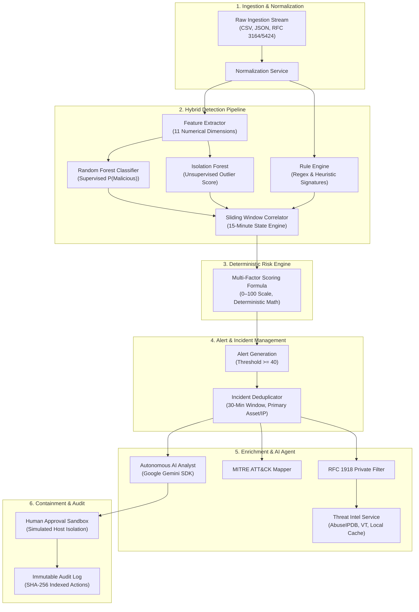
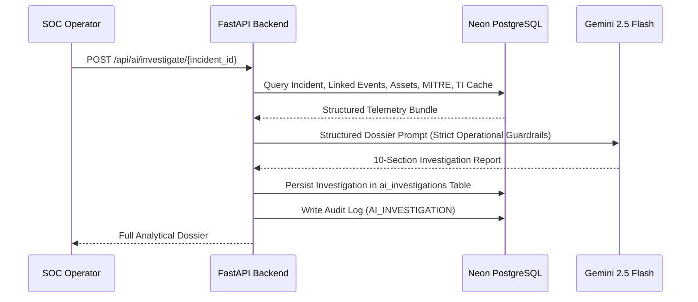

# Architecture & System Design — AI Autonomous SOC

## 1. System Overview

The **AI Autonomous SOC** is architected as an asynchronous, event-driven security operations center platform. It decouples high-throughput log ingestion from analytical investigation workflows, ensuring deterministic detection while augmenting tier-1/tier-2 analysts with generative AI reasoning.



---

## 2. Ingestion & Normalization Pipeline

### Normalization Mechanics
The ingestion pipeline processes raw logs from heterogeneous enterprise appliances (firewalls, web servers, Active Directory, endpoint logs). The `IngestionService` converts incoming records into a unified `SecurityEvent`:

```python
class NormalizedEvent:
    timestamp: datetime
    source_ip: str
    destination_ip: Optional[str]
    source_port: Optional[int]
    destination_port: Optional[int]
    protocol: str              # TCP, UDP, ICMP
    event_type: str            # AUTH_FAILURE, WEB_REQUEST, PORT_SCAN, etc.
    action: Optional[str]      # ALLOWED, BLOCKED, DENIED
    status: Optional[str]      # SUCCESS, FAILURE
    username: Optional[str]
    message: Optional[str]
    bytes_sent: float
    bytes_received: float
    duration: float
    failed_logins: float
    raw_log: str
```

---

## 3. Machine Learning & Anomaly Engine

### 11-Dimensional Feature Vector
To enable microsecond inference latencies, `FeatureExtractor` projects raw events into a fixed numerical vector:

| Index | Feature Name | Description | Rationale |
| :--- | :--- | :--- | :--- |
| `0` | `duration` | Connection duration in seconds | Detects long-lived C2 vs rapid port scans |
| `1` | `src_bytes` | Outbound bytes sent | Flags data exfiltration bursts |
| `2` | `dst_bytes` | Inbound bytes received | Identifies large payload downloads |
| `3` | `source_port` | Ephemeral client port | Identifies unusual high/low ranges |
| `4` | `destination_port` | Target service port | Target service identification (22, 80, 443, 3389) |
| `5` | `protocol_num` | Protocol encoding (1=TCP, 2=UDP, 3=Other) | Categorical protocol separation |
| `6` | `count_10s` | Connections to same dest IP in last 10s | Frequency burst metric |
| `7` | `srv_count_10s` | Connections to same service in last 10s | Targeted service flooding |
| `8` | `failed_logins` | Cumulative failed authentication count | Brute force detection indicator |
| `9` | `is_privileged` | Binary indicator for admin/root attempts | High-risk credential access |
| `10`| `outbound_bytes_rate` | Byte transmission rate (`src_bytes / duration`) | Data staging and exfiltration spikes |

### Supervised Classification
- Champion Model: **Random Forest** (100 estimators, max depth 12).
- Classifications: `NORMAL`, `SUSPICIOUS`, `MALICIOUS`.
- Multi-class category head: Maps attacks to `BRUTE_FORCE`, `PORT_SCAN`, `WEB_ATTACK`, `SUSPICIOUS_LOGIN`, `PRIVILEGE_ESCALATION`, `DATA_EXFILTRATION`.

### Unsupervised Anomaly Detection
- Model: **Isolation Forest** (100 isolation trees, contamination 0.05).
- Output: Returns a continuous outlier score normalized between `0.0` and `1.0`.

---

## 4. Deterministic Multi-Factor Risk Engine

The platform strictly isolates qualitative AI reasoning from official numeric risk scores. The backend computes the risk score using a deterministic formula:

$$\text{BaseRisk} = (C_{\text{ML}} \times 0.30) + (S_{\text{Anomaly}} \times 0.20) + (R_{\text{Rules}} \times 0.25) + (K_{\text{Corr}} \times 0.15) + (A_{\text{Asset}} \times 0.10)$$

$$\text{FinalScore} = \min\left(\text{round}(\text{BaseRisk} \times M_{\text{TI}}), 100\right)$$

Where:
- $C_{\text{ML}} \in [0, 100]$: Supervised model confidence.
- $S_{\text{Anomaly}} \in [0, 100]$: Isolation Forest outlier severity.
- $R_{\text{Rules}} \in [0, 25]$: Accumulation of matched heuristic signatures (12.5 pts per rule, capped at 25).
- $K_{\text{Corr}} \in \{0, 15\}$: 15 points if part of a multi-stage sliding-window correlation chain.
- $A_{\text{Asset}} \in [2, 10]$: Target asset criticality weight (`CRITICAL`=10, `HIGH`=8, `MEDIUM`=5, `LOW`=2).
- $M_{\text{TI}} \in \{1.0, 1.05, 1.15\}$: External Threat Intelligence multiplier (`MALICIOUS`=1.15, `SUSPICIOUS`=1.05, `CLEAN`=1.0).

---

## 5. Sliding-Window Correlation Engine

The correlation engine maintains an in-memory sliding window of 15 minutes grouped by `(source_ip, destination_ip)`. When events transition across kill-chain stages (e.g., Reconnaissance &rarr; Authentication Attempt &rarr; Sudo Execution), a composite correlated pattern is triggered, bumping risk and elevating the event directly to an Incident.

---

## 6. Threat Intelligence & RFC 1918 Protection

Before dispatching external HTTP queries to threat intelligence providers, all indicators are filtered through an RFC 1918 validator:
```
10.0.0.0/8       - Private Class A
172.16.0.0/12    - Private Class B
192.168.0.0/16   - Private Class C
127.0.0.0/8      - Loopback
169.254.0.0/16   - Link Local
```
If an address falls within any private subnet, external network requests to AbuseIPDB or VirusTotal are suppressed. The reputation is synthesized strictly from internal telemetry, preserving corporate network boundaries.

All external lookups for public IPs are cached in PostgreSQL for 24 hours to prevent API rate-limit exhaustion.

---

## 7. Autonomous AI Security Analyst Architecture

The AI Analyst is built using the official Google GenAI SDK (`google-genai`).



### Safety Guardrails
- **Prompt Isolation**: System instructions prohibit Gemini from calculating numerical risk scores or executing network operations.
- **Evidence Grounding**: Gemini is provided the exact database rows for the incident, events, asset inventory, and threat intel, preventing hallucinations.

---

## 8. Simulated Containment & Audit Log

To ensure zero risk to live production systems:
1. **Simulated Host Isolation**: Updates database asset record status to `CONTAINED` and incident status to `CONTAINED`.
2. **Explicit Operator Attestation**: Operator must specify a containment reason and confirm human authorization.
3. **Audit Immutability**: Every action is written to `audit_logs` with actor username, timestamp, resource ID, IP address, and payload parameters.
4. **Safety Banner**: The console renders a persistent banner: *"SIMULATION ONLY — No physical network interface was modified."*
