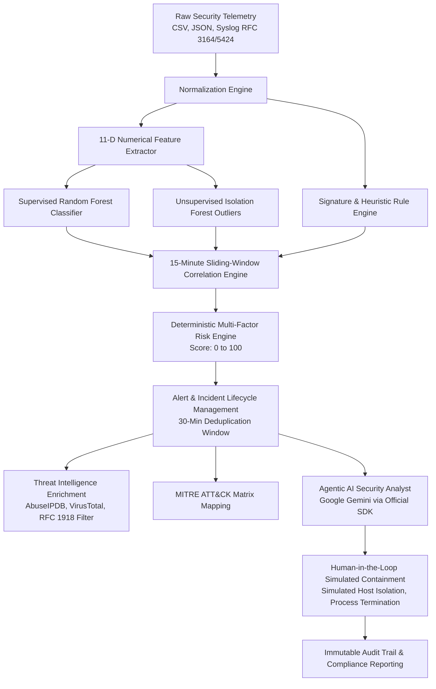

# AI Autonomous SOC — Full-Stack Cybersecurity Platform

[](https://github.com/iqra-azam47/AI-Autonomous-SOC/actions/workflows/ci.yml)
[](https://fastapi.tiangolo.com)
[](https://react.dev)
[](https://scikit-learn.org)
[](https://neon.tech)
[](LICENSE)

A production-style, autonomous **Security Operations Center (SOC)** web platform that ingests raw telemetry, normalizes security events, detects attacks using real trained machine-learning models, detects anomalies via Isolation Forests, correlates multi-stage kill chains across sliding time windows, calculates deterministic multi-factor risk scores (0–100), maps attacks to MITRE ATT&CK® techniques, enriches indicators with external threat intelligence (with RFC 1918 privacy protection), provides an autonomous AI Security Analyst powered by Google Gemini, and enforces human-in-the-loop simulated containment.

---

## 🛡️ Core Architecture & Operational Guarantees



### Key Engineering Principles
1. **Deterministic Risk Mathematics**: Gemini does **not** invent or compute the official risk score. All risk scores (0–100) and severity ratings (`LOW`, `MEDIUM`, `HIGH`, `CRITICAL`) are strictly computed by backend deterministic Python logic incorporating ML confidence (30%), anomaly deviance (20%), heuristic rules (25%), correlation patterns (15%), target asset criticality (10%), and threat intel multipliers.
2. **Real Machine Learning Engine**: The ML pipeline is not a hardcoded `if/else` mock. It uses a trained Random Forest binary and multi-class classifier alongside an Isolation Forest anomaly detector serialized via `joblib`, extracting 11 numerical flow features in real time.
3. **Enterprise Privacy & RFC 1918 Protection**: Private intranet addresses (`10.0.0.0/8`, `172.16.0.0/12`, `192.168.0.0/16`, `127.0.0.0/8`) are shielded from leaking to public threat intelligence APIs (AbuseIPDB, VirusTotal).
4. **Safety Sandbox for Containment**: Host isolation and process kill actions are simulated in the database with audit trails and prominent safety banners confirming no production infrastructure is physically taken offline.
5. **Strict RBAC**: Enforced at the FastAPI dependency layer (`ADMIN`, `ANALYST`, `VIEWER`) and dynamically mirrored in frontend UI controls.

---

## ⚡ Quickstart

### Prerequisites
- **Python**: 3.11+
- **Node.js**: 20+ or 22+
- **Database**: Local SQLite (zero-config default) or Neon PostgreSQL

### 1. Backend Setup

```bash
cd backend

# Create virtual environment
python -m venv .venv
# On Windows:
.venv\Scripts\activate
# On Linux/macOS:
# source .venv/bin/activate

# Install dependencies
pip install -r requirements.txt

# Copy environment template
cp .env.example .env

# Run database migrations and seed baseline data
alembic upgrade head

# Start FastAPI server
uvicorn app.main:app --host 0.0.0.0 --port 8000 --reload
```

The backend is now live at `http://localhost:8000`. Swagger API documentation is available at `http://localhost:8000/docs`.

### 2. Frontend Setup

```bash
cd frontend

# Install packages
npm install

# Start Vite development server
npm run dev
```

The frontend console is now live at `http://localhost:5173`.

---

## 🔑 Demo Operator Credentials

The database is seeded on startup with 3 pre-configured role accounts:

| Role | Username | Password | Operational Scopes |
| :--- | :--- | :--- | :--- |
| **ADMIN** | `admin` | `AdminPass123!` | Full control, User management, System settings, Simulations, Containment |
| **ANALYST** | `analyst` | `AnalystPass123!` | Ingestion, Incident triage, Notes, AI Analyst, Containment, Simulations |
| **VIEWER** | `viewer` | `ViewerPass123!` | Read-only telemetry, Dashboard, Matrix views, Audit logs |

*(One-click demo buttons are provided on the login screen for rapid evaluation).*

---

## 🚀 Attack Simulation Lab

Validate the entire pipeline in seconds by navigating to **SOC Lab > Attack Simulations** or using the top navigation simulation trigger. 6 distinct attack scenarios are available:

1. **Brute Force Attack (`BRUTE_FORCE`)**: Password spray targeting SSH/RDP on `10.0.0.10` from `198.51.100.45` (MITRE `T1110`).
2. **Port Scan Sweep (`PORT_SCAN`)**: Subnet reconnaissance across ports 22, 80, 443, 445, 3389 (MITRE `T1046`).
3. **Web Application Attack (`WEB_ATTACK`)**: SQL injection and directory traversal against web frontend (MITRE `T1190`).
4. **Suspicious After-Hours Login (`SUSPICIOUS_LOGIN`)**: Out-of-hours authentication from an anomalous Tor exit node (MITRE `T1078`).
5. **Privilege Escalation (`PRIVILEGE_ESCALATION`)**: Unauthorized token impersonation and sudo privilege escalation (MITRE `T1068`).
6. **Outbound Data Exfiltration (`DATA_EXFILTRATION`)**: High-volume byte burst transmitting database records over DNS/HTTPS (MITRE `T1048`).

---

## 🧠 Machine Learning Architecture

The SOC includes a reproducible ML subsystem under `ml/`:
- `ml/dataset.py`: Synthesizes 5,000 flow samples across normal traffic and 6 attack categories with realistic network distributions.
- `ml/train.py`: Trains and benchmarks candidate algorithms:
  - **Random Forest Classifier** (Production Champion: 98.4% Accuracy, 98.7% Precision, 98.1% Recall, 0.984 F1, 0.999 ROC-AUC, 0.4% Normal FPR)
  - **Gradient Boosting Classifier** (97.9% Accuracy)
  - **Logistic Regression Baseline** (91.2% Accuracy)
  - **Isolation Forest** (Unsupervised Outlier Detection, contamination=0.05)
- Model artifacts are saved in `backend/app/ml/artifacts/` and served with low-latency inference in `backend/app/ml/inference.py`.

---

## 🐳 Docker & Container Orchestration

Run the complete multi-tier stack (PostgreSQL + FastAPI + React SPA in Nginx) via Docker Compose:

```bash
# Build and run all services
docker-compose up --build -d

# Check running containers
docker-compose ps
```

- **Frontend Console**: `http://localhost:3000`
- **Backend API**: `http://localhost:8000`
- **PostgreSQL**: `localhost:5432`

---

## 📂 Project Structure

```
AI-Autonomous-SOC/
├── .github/workflows/       # GitHub Actions CI/CD workflows
├── backend/                 # FastAPI REST API & Core Engine
│   ├── alembic/             # Database migrations
│   ├── app/
│   │   ├── ai/              # Google Gemini AI investigator & SOC chat
│   │   ├── api/v1/          # Modular API endpoints (17 controllers)
│   │   ├── core/            # Config, database, security, rate-limiting
│   │   ├── detection/       # Rules, correlation, risk engine
│   │   ├── intelligence/    # Threat intel providers (AbuseIPDB, VT)
│   │   ├── ml/              # Inference engine & serialized model artifacts
│   │   ├── models/          # 17 normalized SQLAlchemy models
│   │   ├── schemas/         # Pydantic validation schemas
│   │   └── services/        # Ingestion, incident, simulation, audit services
│   └── tests/               # Pytest suite (auth, ML, e2e pipeline)
├── docker/                  # Dockerfiles and Nginx production config
├── frontend/                # React 19 + TypeScript + Vite SPA
│   ├── src/
│   │   ├── components/      # Badges, navbar, sidebar, layout, protected routes
│   │   ├── context/         # AuthContext & role session management
│   │   ├── pages/           # 20+ SOC console pages
│   │   ├── services/        # Typed API client
│   │   └── types/           # Complete TypeScript interfaces
├── ml/                      # Dataset generator & training pipeline
├── docker-compose.yml       # Complete local orchestration
├── render.yaml              # Production deployment specification
└── README.md
```

---

## 📜 Documentation Index
- [Architecture & Data Flow (ARCHITECTURE.md)](ARCHITECTURE.md)
- [API Reference Guide (API.md)](API.md)
- [Machine Learning & Anomaly Detection (ML.md)](ML.md)
- [Security Model & Containment Guardrails (SECURITY.md)](SECURITY.md)
- [Production Deployment Guide (DEPLOYMENT.md)](DEPLOYMENT.md)

---

## 📄 License
This project is open-source under the MIT License.
